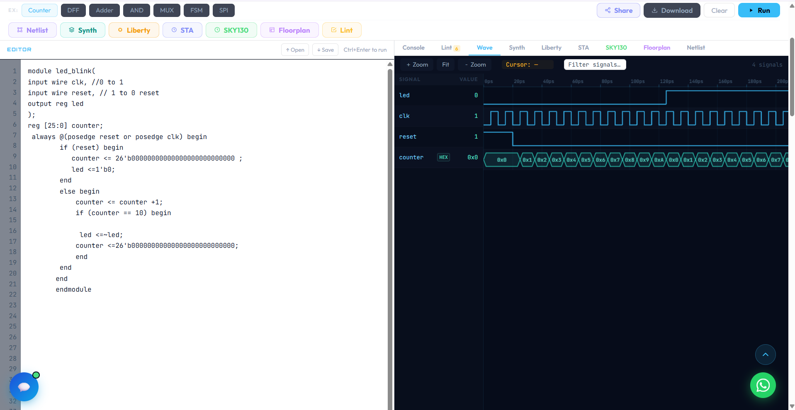
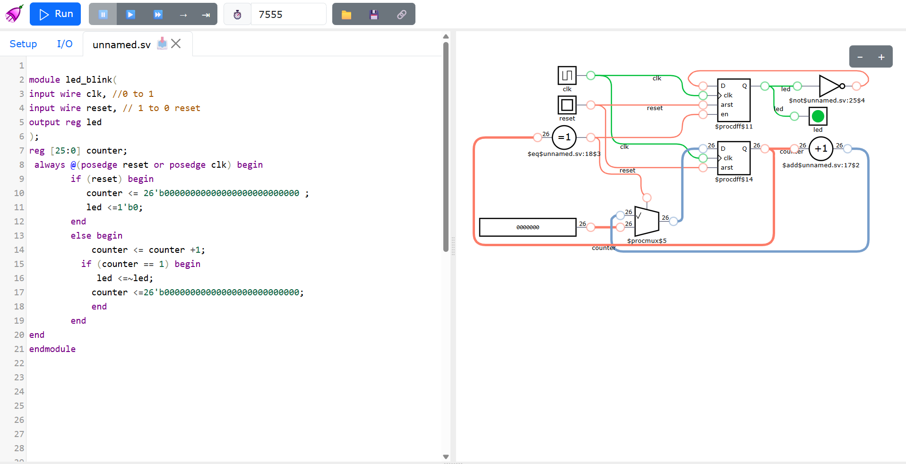

# LED Blink - Verilog Sequential Design

A simple sequential circuit that blinks an LED using a clock divider 
and counter, written in Verilog.

## How it works
- Takes a clock and reset as input
- Counts clock cycles using a 26-bit counter
- Toggles the LED output once the counter reaches a target value
- Resets counter and repeats, creating a continuous blink

## Files
- `led_blink.v` - main design module
- `led_blink_tb.v` - testbench with clock generator and reset sequencing

## Verification
- Simulated and verified via waveform (see screenshot below)
- Also verified visually using an interactive schematic simulator

## What I learned
Building this helped me understand sequential logic, clock dividers, 
blocking vs non-blocking assignment, and how to verify a design 
through both waveform analysis and visual simulation.
